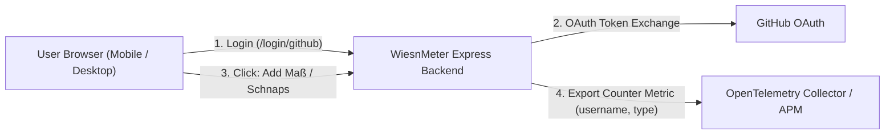

# WiesnMeter 🍺

A lightweight, mobile-friendly Oktoberfest drink tracking web application that allows users to authenticate with **GitHub**, record their drink consumption (**"Add one Maß"** and **"Add one Schnaps"**), and emit real-time **OpenTelemetry** metrics labeled by `username` and `type`.


---

## Features

- **GitHub OAuth 2.0 Authentication**: Seamless login with GitHub profiles (avatar & username).
- **Simple, Tactile UI**: Large, tap-friendly buttons:
  - 🍺 **"Add one Maß"** (1L Bavarian Beer)
  - 🥃 **"Add one Schnaps"** (Shot / Obstler)
- **OpenTelemetry Metrics Export**:
  - **Metric Instrument**: `drinks_total` (Counter, Unit: `{drinks}`)
  - **Labels / Attributes**:
    - `username`: GitHub handle (e.g. `octocat`)
    - `type`: Drink type (`beer` or `schnaps`)
- **Configurable Runtime**: Easily configure the hostname, OAuth credentials, and OpenTelemetry OTLP receiver via environment variables.
- **Developer / Offline Mode (`DEV_MODE=true`)**: Instant one-click simulated login for testing without needing pre-configured GitHub OAuth keys.
- **Production-Ready Docker Image**: Minimal multi-stage Alpine Dockerfile with healthchecks and non-root execution.

---

## Architecture



---

## Configuration & Environment Variables

| Variable | Default | Description |
| :--- | :--- | :--- |
| `PORT` | `3000` | HTTP port on which the web server listens |
| `HOSTNAME` / `APP_BASE_URL` | `http://localhost:3000` | Public base URL used to construct the GitHub OAuth callback URL |
| `GITHUB_CLIENT_ID` | _none_ | GitHub OAuth App Client ID |
| `GITHUB_CLIENT_SECRET` | _none_ | GitHub OAuth App Client Secret |
| `SESSION_SECRET` | `wiesnmeter-secret-key-oktoberfest` | Secret key used for signing session cookies |
| `OTEL_EXPORTER_OTLP_ENDPOINT` | `http://localhost:4318/v1/metrics` | OpenTelemetry OTLP HTTP receiver endpoint |
| `OTEL_SERVICE_NAME` | `wiesnmeter` | OpenTelemetry service name resource attribute |
| `OTEL_METRICS_EXPORTER` | `otlp` | Exporter type: `otlp`, `console`, or `both` |
| `OTEL_METRIC_EXPORT_INTERVAL` | `5000` | Metric export interval in milliseconds |
| `DEV_MODE` | `false` | Enable instant mock login for testing without GitHub keys |

---

## Quick Start (Local)

### 1. Install Dependencies
```bash
npm install
```

### 2. Configure Environment
Copy the sample environment file:
```bash
cp .env.example .env
```

### 3. Run in Development Mode
```bash
npm run dev
```
Open [http://localhost:3000](http://localhost:3000) in your browser.

### 4. Run Automated Tests
```bash
npm test
```

---

## Docker Deployment

### Build Docker Image
```bash
docker build -t wiesnmeter .
```

### Run with Console Metric Output (Quick Test)
```bash
docker run -d \
  -p 3000:3000 \
  -e DEV_MODE=true \
  -e OTEL_METRICS_EXPORTER=console \
  --name wiesnmeter \
  wiesnmeter
```
View the logs as drinks are recorded:
```bash
docker logs -f wiesnmeter
```

### Run with OpenTelemetry Collector via Docker Compose
A `docker-compose.yml` and `otel-collector-config.yaml` are included to test end-to-end telemetry ingestion locally:

```bash
docker compose up --build
```
This starts:
1. **WiesnMeter** at [http://localhost:3000](http://localhost:3000)
2. **OpenTelemetry Collector** listening on port `4318` (HTTP) and `4317` (gRPC), printing all incoming metrics to stdout.

### Deploying Behind Traefik Reverse Proxy

The [`docker-compose.yml`](docker-compose.yml) is pre-configured with Traefik routing labels and network configuration.

1. **Ensure the external Traefik network exists**:
   ```bash
   docker network create traefik-net # or use your existing Traefik network
   ```

2. **Configure your `.env`**:
   ```bash
   DOMAIN=wiesn.yourdomain.com
   TRAEFIK_NETWORK=traefik-net
   TRAEFIK_ENTRYPOINT=websecure
   TRAEFIK_CERT_RESOLVER=letsencrypt
   HOSTNAME=https://wiesn.yourdomain.com
   GITHUB_CLIENT_ID=your_id
   GITHUB_CLIENT_SECRET=your_secret
   SESSION_SECRET=$(openssl rand -hex 32)
   COOKIE_SECURE=true
   ```

3. **Start the stack**:
   ```bash
   docker compose up -d --build
   ```

---

## Setting Up the GitHub App (for Public Access)

To allow anyone on GitHub to log into WiesnMeter:

### Option A: GitHub OAuth App (Recommended & Simplest)
OAuth Apps are **public by default**; any GitHub user can log in with one click without needing an installation flow.

1. Open [GitHub Developer Settings &rarr; OAuth Apps](https://github.com/settings/developers).
2. Click **New OAuth App** (or register under an Organization if preferred).
3. Fill in:
   - **Application name**: `WiesnMeter`
   - **Homepage URL**: `https://<YOUR_DOMAIN>` (e.g. `https://wiesn.yourdomain.com`)
   - **Application description**: Oktoberfest Drink Tracking & Telemetry
   - **Authorization callback URL**: `https://<YOUR_DOMAIN>/login/github/callback`
4. Click **Register application**.
5. Click **Generate a new client secret**.
6. Copy the **Client ID** and **Client Secret** into your `.env` file (`GITHUB_CLIENT_ID` and `GITHUB_CLIENT_SECRET`).

### Option B: GitHub App
If you prefer creating a GitHub App:
1. Open [GitHub Developer Settings &rarr; GitHub Apps &rarr; New GitHub App](https://github.com/settings/apps/new).
2. Set **Callback URL**: `https://<YOUR_DOMAIN>/login/github/callback`.
3. Under **Where can this GitHub App be installed?**, select **"Any account"** (to make it public for anyone).
4. Permissions: Set **Account permissions &rarr; Email addresses** to `Read-only` (or leave default user read).
5. Generate a client secret and save client ID & secret.

---

## API Endpoints

- `GET /healthz` - Healthcheck returning service status and OpenTelemetry configuration.
- `GET /api/config` - Public app configuration (dev mode status, GitHub setup).
- `GET /api/me` - Returns active session user profile and session stats.
- `GET /login/github` - Initiates GitHub OAuth authorization redirect.
- `GET /login/github/callback` - OAuth callback exchanging code for session.
- `POST /login/dev` - Simulated login for local/offline testing (`DEV_MODE=true`).
- `POST /logout` - Terminates session.
- `POST /api/track` - Records a drink. Payload: `{ "type": "beer" | "schnaps" }`. Exports `drinks_total` metric.

---

## License

MIT